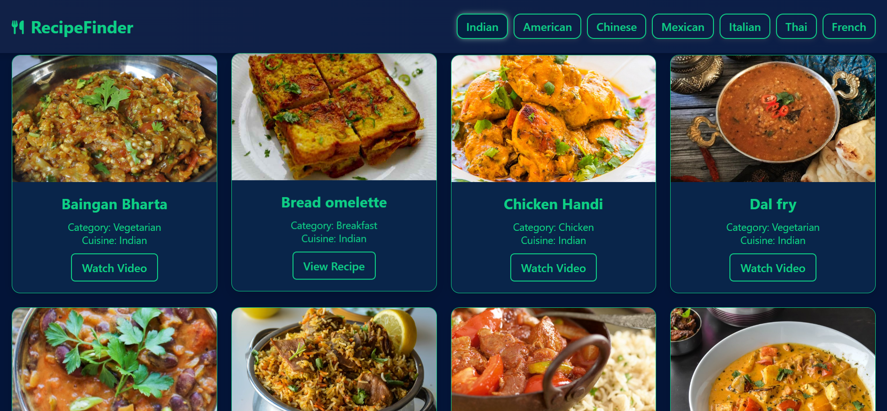

<h1 align="center">🍴 Recipe Finder App</h1>

  <i>Discover recipes across cuisines 🌍 | Quick Meals ⚡ | Nutrition Focused 🥗</i>

  <!-- Live Demo -->
  
  &nbsp;
  <!-- GitHub Repo -->
  
  &nbsp;
  <!-- Made With Love -->
  

---

<h2 align="center">📖 About</h2>

  Recipe Finder is a <b>frontend web app</b> to search and explore recipes from multiple cuisines like  
  <b>Indian 🇮🇳, Italian 🇮🇹, Mexican 🇲🇽, Japanese 🇯🇵</b>.

  ✅ Quick Meals (30-min recipes)  · 🥦 Nutrition-focused  · 🌐 Global Flavors  · 📱 100% Responsive

---

<!-- Banner -->
  

  
  

  
---

<h2 align="center">🛠️ Tech Stack</h2>

  &nbsp
  &nbsp
  &nbsp
  &nbsp

---

<h2 align="center">🚀 Features</h2>

| 🌟 Feature | 💡 Description |
|------------|----------------|
| 🔎 Search Recipes | Search by dish name / keyword |
| 🍛 Cuisine Filters | Filter recipes (Indian, Italian, Mexican, Japanese) |
| 🖼️ Recipe Cards | Image, title & info displayed |
| 📱 Responsive UI | Mobile-first design |
| ⚡ Quick Meals | Recipes < 30 minutes |
| 🥗 Nutrition Focused | Calorie/diet details |

---

<h2>📂 Project Structure</h2>
  
Recipe-Finder-App/ 
├── index.html ├── css/ 
│   └── style.css 
├── js/ 
│   └── script.js 
├── assets/ 
│   └── (images/screenshots) 
└── README.md

